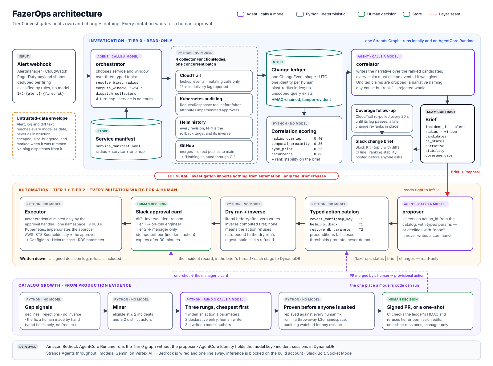

# FazerOps architecture

<p align="center">
  
</p>

---

## 1. The shape in one paragraph

An alert arrives on a generic webhook. A **read-only investigation** runs as one Strands `Graph`: an
orchestrator agent picks the service and the time window through three typed tools; four collector
nodes read CloudTrail, the Kubernetes audit log, Helm history and GitHub **in one concurrent batch
without calling a model**; their events are normalized into a change ledger; Python scores every
candidate; a correlator agent writes a narrative that may cite only the evidence it was given. The
result is a `Brief`, and **the `Brief` is the only thing that crosses into automation**. There, a
proposer agent selects an action from a typed catalog, Python computes the dry run and the inverse,
a human approves on a Slack card, and an executor runs the action with a credential that exists only
because of that approval. When the catalog has no action for the cause, that fact is recorded, and
catalog growth turns repeated gaps into a reviewed pull request.

## 2. Two layers, one seam

| Layer             | Tier    | What it may do                                               | Entry points                                                               |
| ----------------- | ------- | ------------------------------------------------------------ | -------------------------------------------------------------------------- |
| **Investigation** | 0       | Read. Autonomous, and finished before anyone opens a laptop. | `main.py` (webhook), `agentcore_app.py` (AgentCore Runtime), `pipeline.py` |
| **Automation**    | 1 and 2 | Propose, dry-run, and execute on a human's approval.         | `actions/server.py` (alerts, Slack cards, clicks, growth job)              |

The contract between them is frozen:

```
Investigation ──emits──▶ Brief{incident_id, alert, radius, window, candidates, ci_status,
                               narrative, evidence_ids, degraded, stability, coverage_gaps}
                                         │
Automation    ──emits──▶ Proposal{action_id, params, rationale, evidence_ids}
```

- The investigation layer **imports nothing** from `actions/`, `slack/handlers.py` or
  `security/credentials.py`. A `Brief` renders to Slack, stdout or markdown with the whole automation
  layer deleted. `tests/integration/test_layer_seam.py` enforces this by blocking those imports and
  running the full investigation.
- The graph receives the proposer **by injection** (`proposer_node=`), which is how
  `agents/graph.py` stays free of the automation layer. The AgentCore deployment builds the graph
  **without** it, so the deployed endpoint can investigate and cannot change anything.
- Automation never reaches back into the ledger or re-scores. It reads a `Brief`.
- `Candidate.inverse_hint` is opaque data to the investigation layer; only `actions/inverse.py`
  interprets it.

## 3. The Strands graph

```
orchestrator (Agent) ──▶ ┌ cloudtrail  (FunctionNode) ┐
                         │ k8s_audit   (FunctionNode) │ one batch,
                         │ helm        (FunctionNode) │ concurrent
                         └ github      (FunctionNode) ┘
                                     │
                                     ▼
                         correlator (Agent) ──▶ proposer (Agent)
```

| Node                                        | Calls a model? | Why                                                                    |
| ------------------------------------------- | -------------- | ---------------------------------------------------------------------- |
| `orchestrator`                              | **Yes**        | Chooses scope and window, a judgment over a bounded, typed space       |
| `cloudtrail`, `k8s_audit`, `helm`, `github` | No             | Call an API, filter, normalize, emit. No decision exists on this path. |
| `correlator`                                | **Yes**        | Writes the human explanation and cites evidence                        |
| `proposer`                                  | **Yes**        | Selects an action and fills in its parameters                          |
| scoring, diffing, inverse                   | No             | Arithmetic and data transformation                                     |

### "Strands throughout" does not mean "every node calls a model"

A reviewer will reasonably ask why four of the seven nodes are not agents. The answer is a
distinction between the **framework** and the **model**.

**Every node in this build is a Strands object.** Each collector subclasses
`strands.multiagent.base.MultiAgentBase` (the `FunctionNode` in `agents/graph.py`), is registered with
`GraphBuilder.add_node()` exactly as the agents are, is scheduled by the Strands `Graph`, appears in
`result.execution_order`, and returns Strands' own `MultiAgentResult` and `NodeResult`. No code path
runs outside the graph. `MultiAgentBase` is Strands' supported way to place deterministic work in a
graph; the SDK documentation's own example is titled _"Execute deterministic Python functions as graph
nodes."_ The only thing that varies between nodes is whether one calls a model.

| Strands surface                                              | Used for                                                                 |
| ------------------------------------------------------------ | ------------------------------------------------------------------------ |
| `Agent`                                                      | orchestrator, correlator, proposer, and the catalog-growth writer author |
| `@tool`                                                      | the orchestrator's three typed tools                                     |
| `GraphBuilder` / `Graph`                                     | the whole investigation topology                                         |
| `MultiAgentBase`, `NodeResult`, `MultiAgentResult`, `Status` | the four collector nodes                                                 |
| `GeminiModel` / `BedrockModel`                               | per-agent model providers, switched by configuration                     |
| `structured_output`                                          | constrained output on every agent                                        |
| `Limits(turns=4)`                                            | the orchestrator's turn cap                                              |

Making the collectors agents would have cost four things, most severe first:

1. **It would break the golden ranking test.** A model in the collection path makes the pipeline
   non-deterministic, so `tests/integration/test_ranking_golden.py`, the test that _is_ the demo,
   could flake.
2. **It would corrupt the ledger.** A model transcribing CloudTrail JSON can drop an event, mistype a
   timestamp or invent an actor, and the symptom surfaces in the scorer, far from its cause. The
   ledger is the product's defensibility; it has to be exact.
3. **It would break two of the design's own rules**: scores are computed in Python, and the model
   never constructs a query.
4. **It would multiply cost roughly sixfold.** Agentic collectors need raw payloads in context:
   about 62k input tokens per run instead of about 10k.

The multi-agent claim is earned honestly by three agents that hold real decisions. Wrapping
deterministic work in prompts to inflate the node count is exactly what a reader who opens the repo
would notice.

### Timeouts, and a Strands behaviour found by testing

Python's `Graph` runs independent nodes in **batches with a barrier**: a batch retires only when its
slowest node does, so a rate-limited CloudTrail call delays correlation even after Kubernetes has
answered. That is accepted and bounded.

`set_node_timeout()` does not degrade a slow node. It **fails the whole graph**, cancelling every
sibling. Because one dead source must degrade the brief rather than erase it, each `FunctionNode`
enforces its own 30-second timeout inside the node and records the failure on the brief. The graph's
own timeout is kept as a backstop, at four times that, for work that never yields to the event loop.
The live orchestrator has its own 90-second bound: if it times out or fails, the collectors run on
the alert's own service over the default window, and the brief says it is degraded.

## 4. Investigation, component by component

### Alert ingest — `ingest/`, `main.py`

- **Payload shapes.** `ingest/alerts.py` normalizes Alertmanager, CloudWatch and PagerDuty payloads
  into one `Alert`. PagerDuty is a supported shape, not a dependency.
- **Classification by rules, not a model.** `ingest/classify.py` maps authored fields first, then
  free text, to `latency_spike`, `error_rate_spike`, `connection_refused`, `auth_failure`, `oom` or
  `disk_pressure`. Anything else is `unclassified`, never a guess.
- **One incident per firing.** Incident ids are `INC-{alert.id}-{fired_at UTC}`, so next week's alert
  on the same rule does not collide with this week's approval. `ingest/dedupe.py` answers a
  re-delivered firing with the first delivery's result on every endpoint.

### Blast radius — `radius.py`, `config/service_manifest.yaml`

The radius is the named service plus **one hop** through `depends_on`, read from a checked-in
manifest. Two hops made the candidate set explode. An unknown service resolves to nothing, never to
everything. The orchestrator's `resolve_blast_radius` takes the service as an **enum built from the
manifest at import time**, so the model cannot name a service that does not exist.

### Collectors — `collectors/`

Every collector implements `fetch()` and returns a `CollectorResult` (events **or** an error), because
an empty list cannot tell "nothing changed" from "the source was down", and the first reading is the
most dangerous wrong answer this product can give. Every collector runs in fixture mode and live mode
through the same normalizers.

| Collector       | Reads                      | Details that matter                                                                                                                                                                                                                                                                                                                |
| --------------- | -------------------------- | ---------------------------------------------------------------------------------------------------------------------------------------------------------------------------------------------------------------------------------------------------------------------------------------------------------------------------------- |
| `cloudtrail.py` | `lookup_events`            | Mutating calls only: `Describe*`, `Get*`, `List*` and `AssumeRole` are dropped. Lambda versions its event names (`UpdateFunctionConfiguration20150331v2`), so names match by prefix. `IAMUser`, `AssumedRole` and `Root` identities normalize; unknown shapes pass through rather than raise. Declares a 15-minute `delivery_lag`. |
| `k8s_audit.py`  | The API server's audit log | `create`, `update`, `patch`, `delete` only; `system:serviceaccount:kube-system:*` excluded. At `RequestResponse` level for ConfigMaps and Secrets, so a change carries its **real before and after**. Reads `impersonatedUser`, so a FazerOps execution is attributed to its approver. Survives log rotation.                      |
| `helm.py`       | `helm history -o json`     | Every revision per release in the radius; N−1 is the rollback target.                                                                                                                                                                                                                                                              |
| `github.py`     | The GitHub API             | Merged pull requests **and direct pushes to the default branch**. A push is collected but not counted as shipped through CI.                                                                                                                                                                                                       |

### The change ledger — `ledger/`

- **One shape.** `ledger/normalize.py` turns every source into a `ChangeEvent`. Three timestamp formats
  (CloudTrail's `Z` suffix, Kubernetes RFC 3339 with variable precision, Helm's local-time string)
  collapse to one UTC instant, and naive input raises. `config/identity_map.yaml` resolves an IAM ARN,
  a Kubernetes username and a GitHub handle to one person; an unmapped actor passes through marked
  unresolved.
- **Scoped by construction.** `ledger/store.py` indexes every event by each of its blast-radius keys.
  `query()` requires a radius and has no unscoped variant. It also records alert _signatures_, never
  briefs or rankings, so a later scoring change cannot rewrite history.
- **Tamper-evident.** `ledger/chain.py` gives each line an HMAC-SHA256 chained to the line before it,
  keyed by `FAZEROPS_EVIDENCE_KEY`, with `flock`ed appends so the server and the growth job extend the
  same tail. An edited, inserted, removed or reordered line reads `BROKEN`, and catalog growth, bundle
  attestation and CI all refuse a broken ledger.

### Scoring — `correlation/`

Four features, a weighted sum, and a hand-authored prior table, all in Python:

| Feature              | Weight | Meaning                                                                                                                          |
| -------------------- | ------ | -------------------------------------------------------------------------------------------------------------------------------- |
| `radius_overlap`     | 0.40   | 1.0 for the service's own resources, 0.5 one hop away                                                                            |
| `temporal_proximity` | 0.35   | exponential decay, 40-minute half-life                                                                                           |
| `type_prior`         | 0.25   | `(action, resource type) × alert class` from `config/priors.yaml`; unlisted cells use a declared default                         |
| `recurrence`         | 0.00   | has this change class preceded this alert signature before? Computed from the ledger; weighted zero because the demo starts cold |

- `in_band` (whether a change went through CI) is **never an input to the score**, or the system
  would rank its own premise. `tests/unit/test_scoring.py` checks this by reading the AST of
  `scoring.py` and `features.py`.
- **Ranking stability.** `correlation/sensitivity.py` puts a line on every brief. It says either that
  rank 1 leads on every feature, so no weighting can rank another change above it, or the smallest
  single-weight change that would let another change draw level. Because the score is linear in the
  weights, that answer is exact rather than sampled. The demo's rank 1 is dominant.
- **The golden test.** `tests/golden/demo_ranking.json` asserts the demo's order, score bands, the
  recorded audit ids, and a rank-1 margin of at least 0.15 (actual: 0.27).

### The correlator — `agents/correlator.py`

The correlator writes a narrative over the ranked candidates through `structured_output`. A validator
enforces two rules, deliberately differently:

- **An uncited or fabricated claim is dropped**, and the rest of the narrative survives. A claim
  citing one real and one invented id is dropped whole, because that is the shape that reads as
  sourced.
- **A narrative naming any primary cause other than rank 1 is rejected whole.** The model cannot see
  the features, so it may not overrule the ranking.

Drops are recorded on the result, never swallowed.

### The untrusted-data envelope — `security/envelope.py`

Every alert field, log line and diff value reaches a model inside `<untrusted_data>` tags, with
closing tags escaped so content cannot break out. The system prompts say the content is data to
analyze, never instructions. Diffs are held to a **spent character budget** across all keys, not
per value: a wholesale ConfigMap rewrite once projected to 790 tokens against a 250-token budget.
Keys that do not fit are reported as `keys_omitted`, so a trimmed diff can never be read as complete.
`render_candidate_for_llm` and `render_alert_for_llm` are the only paths into model context.

### Coverage follow-up — `coverage.py`

CloudTrail delivers events minutes late. A live query at alert time reports the unseen minutes as
`Brief.coverage_gaps`, not as `degraded`, because otherwise every live brief would be degraded and the
flag would mean nothing. **The brief is never held.** It posts at alert time. `watch_coverage` then
polls only CloudTrail every 20 seconds until the lag has passed; a late change re-ranks the brief
immediately, the automation server edits the posted message in place, and every open approval card
says so above its diff.

## 5. Automation, component by component

### The proposer — `agents/proposer.py`

The proposer returns `{action_id, params, rationale, evidence_ids}` and nothing else. `action_id` is a
`Literal` over the catalog, `params` validate against the action's schema **before any client is
constructed**, and `evidence_ids` must be a subset of what the correlator cited. `"none"` is a
first-class answer: a decline, or a proposal with no computable inverse, is recorded as a gap signal.

### The catalog — `actions/catalog.py`, `config/actions.yaml`, `config/thresholds.yaml`

| Action                 | Tier       | Dry run                          | Inverse                               |
| ---------------------- | ---------- | -------------------------------- | ------------------------------------- |
| `revert_configmap_key` | 1          | before/after of the key          | revert again, to the current value    |
| `helm_rollback`        | 1          | diff against the target revision | roll back to the revision current now |
| `restore_db_parameter` | 2, manager | parameter-group diff             | restore the current value             |

- **Tier is declared, never inferred.** `thresholds.yaml` can promote Tier 1 to Tier 2 (cost delta,
  resource count, crossing a namespace boundary) and **cannot demote**.
- **No declared-but-unimplemented actions.** Every entry resolves a real executor, dry-run renderer
  and inverse.
- **Preconditions fail closed** (`actions/preconditions.py`), and they check the collected evidence.
  That is why approval cards expire after 30 minutes.

### Dry run and inverse — `actions/dry_run.py`, `actions/inverse.py`

The dry run renders the literal before and after and makes zero mutating calls. The inverse is
computed **before** execution, and `execute()` raises when it is `None`. A secret's value is masked
and never printed back, and a changing secret is never shown as unchanged just because both values
mask to the same string. Each dry run has a **digest**, and the approval card carries it.

### The approval gateway — `actions/approval.py`, `slack/handlers.py`

A click must pass, in order: Slack signature verification (`slack/signature.py`, stale timestamps
refused), the approver roster (`actions/roster.py`, **empty means nobody**), the tier (a Tier 2 action
refuses an on-call approval), the digest (a card from before a re-registration is refused as
`StaleCard`), expiry, and idempotency on `(incident_id, action_id)` (a replay executes once and
returns the first result). Every click, refusals included, goes to a signed decision log
(`actions/decision_log.py`). Once a decision is recorded, the card and the brief close in place, and
refusals are answered privately.

### Credentials and execution — `security/credentials.py`, `actions/executors/`

- **Two principals.** The reader is broad, read-only and long-lived. The actor credential is minted
  only by the approval handler: `mint_actor_credential` refuses unless the **calling frame's module**
  is on a frozen allowlist, and `ActorCredential` refuses construction without a module-private
  sentinel. It is scoped to one namespace or one parameter group, lives at most 900 seconds, and
  covers one action. This cannot stop a caller that deliberately reaches into module internals, and
  the module's docstring says so. `test_every_executor_calls_the_gate` reads the AST of every
  executor, including generated writers.
- **Kubernetes and Helm** run as `fazerops:approved-by:<slack id>` through impersonation
  (`actions/k8s_client.py`, `helm --kube-as-user`, `config/k8s/fazerops-actor-rbac.yaml`), so the
  audit log names the approver.
- **AWS** runs through STS `AssumeRole` on `FAZEROPS_ACTOR_ROLE_ARN`, with `SourceIdentity` set to
  `slack-<approver>`, session tags for incident, action and approver, and an inline session policy
  naming one parameter group. Without the role, AWS actions are refused before a card opens
  (`config/aws/`).

### The record — `record/`

`record/session.py` is the incident's session state: incident id, alert, radius, events,
candidates, narrative, proposal, approval and approver, execution result. It is persisted once per
stage and never overwritten (`record/store.py`: DynamoDB live; AgentCore Memory written against the
service model but unverified). The same object is the input to `record/markdown.py`, the incident
record posted into the brief's Slack thread on each decision. Result and inverse values are never
reproduced in it, and an alert summary cannot forge a section.

### Slack surface — `slack/`

Socket Mode, so there is no tunnel. Two Block Kit messages: the **change brief** (alert, window,
sources, top three candidates with collapsed diffs, the CI line, the stability line, and _Show all
changes_) and the **approval card** (the action in plain language, the dry-run diff, the inverse, the
tier and, for Tier 2, why it escalated). Decisions are made on the card alone. `/fazerops status |
brief | changes | help` is read-only, gated by the roster, answered ephemerally and matched against
four fixed shapes. It has no subcommand that can decide anything.

## 6. Catalog growth — `actions/growth/`, `actions/writers/`

A catalog written by the builders is wrong for everyone who is not the builders. The agent already
knows when it has found a cause it cannot act on, so that knowledge is kept.

1. **Signals** (`signals.py`): declines, rejected proposals, missing inverses, unactionable change
   classes, and the fix a human made by hand afterwards. Each is a typed record of scalars and enums
   only. **No free text**, because the ledger is built from attacker-influenceable text.
2. **Mining** (`miner.py`): a gap is eligible at **two or more incidents and two or more distinct
   actors** (`config/catalog_growth.yaml`), recounted only from signals the ledger's chain still
   vouches for.
3. **Three rungs, cheapest first** (`generate.py`): widen an existing action's parameters (only
   widenings the hand-written code already supports); a declarative entry over a human-written writer
   (`actions/writers/`); or, only when neither can express the gap, a **writer whose `read` and `write`
   a model authors** (`agents/writer_author.py`, gated by `authoring.py`: an AST allowlist, a fixed
   template CI re-renders, and a probe in a separate interpreter against a fake client). A writer
   never supplies its own inverse, dry run or credential check.
4. **Proof before anyone is asked**: every route is replayed in dry run against **every fix a human
   actually made** for the gap, and must agree. Generated code then runs in a **throwaway Kubernetes
   namespace** (`sandbox.py`) under an identity that can touch one resource type, with the audit log
   watched; reaching for anything else rejects it.
5. **A signed pull request** (`pr.py`, `job.py`) cites the event ids that motivated it, with evidence
   HMAC-signed by the ledger's deployment. CI (`scripts/check_generated_pr.py`) rejects agent-authored
   commits whose evidence is unsigned, or that author a tier, delete an action or touch
   `credentials._ACTIONS_FOR`. A merged generated action is **provisional** (`lifecycle.py`): it needs
   a manager's approval every time until five clean approvals with no human fix in the same radius
   within an hour. Retired actions stay resolvable for old incident records.

**The one-shot** (`one_shot.py`): during an incident, when the proposer declines and the top-ranked
change is a Kubernetes change no action can revert, Python (never the model) builds an action for
that incident from the recorded prior value. It is contained in the sandbox, shown to a **manager** as
a card, runs in a separate interpreter pinned to the one resource on the card, and executes at most
once per `(incident, resource, field)`. It never enters the catalog. The manager approves a diff, not
the code. CloudTrail changes never get a one-shot: no prior value is recorded, and delivery is late.

This is the one place a model's output eventually executes. The model still **never names an
action**: the path is triggered deterministically by its existing `"none"`, so the proposer's
`Literal` and the injection suite's central assertion are unchanged.

## 7. Deployment

| Piece                  | Where                                             | Notes                                                                                                                                                                                                                                             |
| ---------------------- | ------------------------------------------------- | ------------------------------------------------------------------------------------------------------------------------------------------------------------------------------------------------------------------------------------------------- |
| Investigation endpoint | **Amazon Bedrock AgentCore Runtime**, `sa-east-1` | `agentcore_app.py` + the root `Dockerfile` (aarch64). One invocation runs the whole graph without the proposer. Built and deployed only with `scripts/deploy_agentcore.sh`, which first copies the root `Dockerfile` over the toolkit's own copy. |
| Model key              | **AgentCore Identity** API-key provider           | Fetched with the workload token, so it is in no Runtime configuration; an invocation must name a user (`--user-id`).                                                                                                                              |
| Session state          | **DynamoDB**                                      | Append-only rows per stage; the Runtime and the automation server both write.                                                                                                                                                                     |
| Automation server      | Any host that can reach the cluster and Slack     | `python -m fazerops.actions.server`: alert endpoint, Socket Mode listener, coverage follow-up and the hourly growth job, in one process, because a card and the click that decides it must reach the same in-memory gateway.                      |
| Actor role             | IAM `fazerops-actor`                              | Trust requires a `slack-*` `SourceIdentity`; see `config/aws/README.md`.                                                                                                                                                                          |
| Inference              | **Gemini on Vertex AI**                           | Bedrock inference is blocked on the build account; `agents/llm.py` keeps Bedrock as a first-class path, and switching back is one line (`ACTIVE_PATH`).                                                                                           |

## 8. Where each guarantee is enforced

| Guarantee                                            | Enforced in                                                     | Asserted by                                                                                         |
| ---------------------------------------------------- | --------------------------------------------------------------- | --------------------------------------------------------------------------------------------------- |
| The investigation layer runs with automation deleted | import boundaries                                               | `tests/integration/test_layer_seam.py`                                                              |
| Zero network in fixture mode                         | `socket.socket` patched to raise, `AWS_*` cleared, `HOME` moved | `tests/integration/test_no_network.py`                                                              |
| The demo ranks the real cause first, by a margin     | `correlation/`                                                  | `tests/integration/test_ranking_golden.py`                                                          |
| `in_band` never scored                               | `correlation/scoring.py`                                        | `tests/unit/test_scoring.py` (AST)                                                                  |
| No action outside the catalog, even under injection  | `agents/proposer.py`, `actions/catalog.py`                      | `tests/security/test_injection_*.py`, `tests/security/test_action_allowlist.py`                     |
| Every executor passes the credential gate            | `security/credentials.py`                                       | `test_every_executor_calls_the_gate` (AST)                                                          |
| A replayed or stale approval executes nothing        | `actions/approval.py`                                           | `tests/integration/test_approval_idempotency.py`, `tests/integration/test_stale_card_and_expiry.py` |
| Tier 2 refuses an on-call approval; nothing demotes  | `actions/approval.py`, `actions/catalog.py`                     | `tests/integration/test_tier2_routing.py`, `tests/unit/test_tier_promotion.py`                      |
| The approver appears in the audit log and CloudTrail | `actions/k8s_client.py`, `security/credentials.py`              | `tests/security/test_actor_attribution.py`, `tests/e2e/test_actor_attribution_live.py`              |
| A tampered ledger is refused                         | `ledger/chain.py`                                               | `tests/unit/test_ledger_chain.py`                                                                   |
| The miner reads no free text                         | `actions/growth/signals.py`                                     | `tests/security/test_miner_takes_no_free_text.py` (schema)                                          |
| Generated code stays in its declared resource        | `actions/growth/sandbox.py`                                     | `tests/e2e/test_containment.py`                                                                     |
| A one-shot runs once                                 | `actions/growth/one_shot.py`                                    | `tests/integration/test_one_shot_idempotency.py`                                                    |
| No secret is tracked                                 | CI                                                              | `tests/test_no_secrets.py`, `gitleaks`                                                              |

## 9. Test modes

| Mode            | Command                                                                                                        | Needs                                             | Count |
| --------------- | -------------------------------------------------------------------------------------------------------------- | ------------------------------------------------- | ----- |
| Default (CI)    | `FAZEROPS_MODE=fixture FAZEROPS_LLM=stub pytest -m "not cluster and not aws and not github and not agentcore"` | nothing                                           | 1,720 |
| Cassette replay | `FAZEROPS_LLM=cassette pytest tests/agents tests/security`                                                     | nothing                                           | 345   |
| Cluster         | `pytest -m cluster`                                                                                            | k3d via `scripts/setup_k3d.sh`                    | 31    |
| AWS             | `pytest -m aws`                                                                                                | read-only credentials                             | 6     |
| GitHub          | `pytest -m github`                                                                                             | network, a test repo                              | 5     |
| AgentCore       | `pytest -m agentcore`                                                                                          | the deployed Runtime; **one paid model run each** | 6     |

Fixtures under `fixtures/` are **recordings from the real sources** (a live API server, a real Helm
release, a real AWS account), with only timestamps shifted onto the demo's window. Each directory's
README states what was edited, and `scripts/capture_*.py` regenerate them.

## 10. What's next

- **Ranking feedback.** Record whether rank 1 was the cause, the first real evidence for or against
  the weights and priors, which are hand-set today.
- **Post-execution verification.** Re-read state to confirm a remediation took effect, instead of
  leaving recovery to the human's eyes.
- **Prior values for AWS changes.** Snapshot resources (or read an S3 trail) so CloudTrail-sourced
  changes carry a before/after and can become reversible.
- **Classifying unknown event shapes.** A bounded, agentic fallback that maps an unrecognized change
  onto the normalized action enum. This is the one place an agent in the collection path would earn
  its place.
- **Sandboxes beyond Kubernetes**, so catalog growth and one-shots can reach other resource types.
- **An off-host anchor for the ledger chain's head**, so truncation of the newest lines is caught too.
- **AgentCore Memory and Bedrock inference**, once the account's quotas and inference block clear.
  Both paths are already wired.
